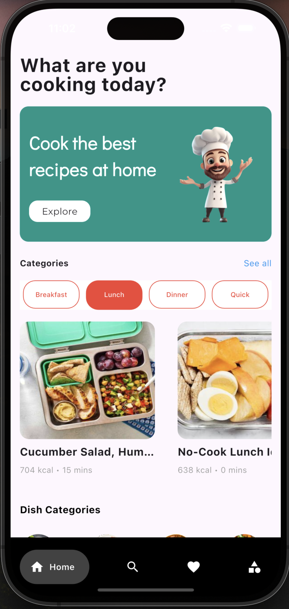
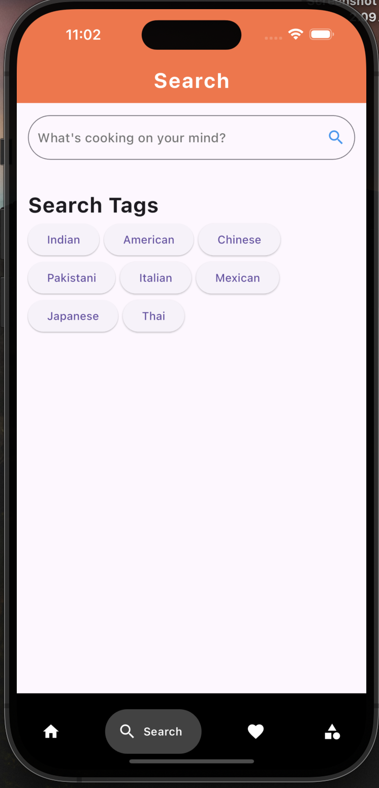
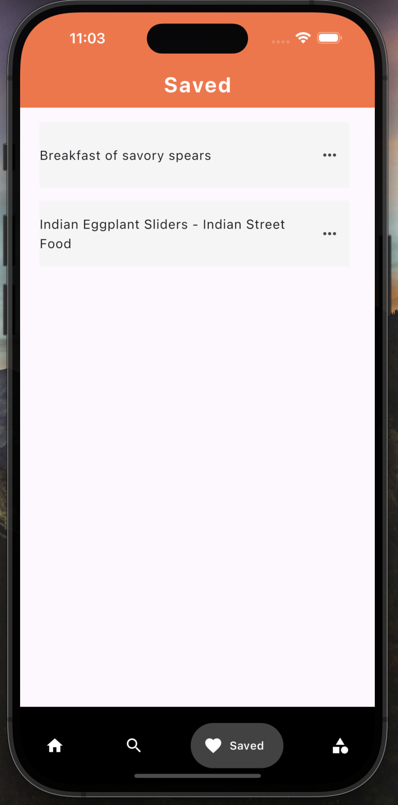
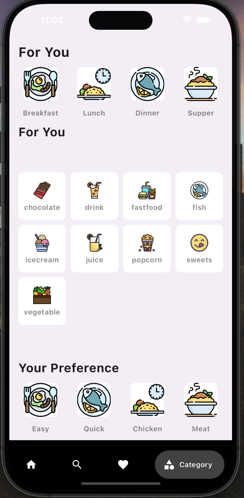

# Recipe Finder App

The Recipe Finder App is a Flutter-based application that allows users to discover a variety of recipes, search for specific dishes, and save their favorites. Users can create an account or log in to explore different categories, see recipe suggestions, and tailor their experience by selecting preferences. Firebase is used for user authentication, while Hive is used for local storage of favorite recipes. Recipes are fetched using the Edamam API.


### Features

**User Authentication:**
    Users can sign up or log in using Firebase Authentication to securely access their accounts.

**Browse Recipes:** 
    A variety of recipes are displayed on the home screen, personalized based on the user’s selected categories.
    Recipes are filtered by categories, making it easy to explore different types of cuisine. Recipe data is fetched from the Edamam API.

**Recipe Search:**
    Users can search for specific recipes directly from the search bar, enhancing the browsing experience.  

**Favorite Recipes:**
    Users can save their favorite recipes to access them later. Hive is used for local storage, allowing easy retrieval of saved recipes.

**Category Filtering:**
    The categories section provides a wide range of categories for users to choose from, helping them discover dishes based on their preferences.      


### Technologies Used
**Flutter:** For building the cross-platform application.

**Firebase Authentication:** For user login and registration.

**Hive:** For local storage to save favorite recipes.

**Edamam API:** Used to fetch recipes and category details.


## Installation

**Clone the repository:**

```bash
  git clone git clone https://github.com/shivansh00011/Recipe-finder-app.git
  cd Recipe-finder-app
```

**Install dependencies:**

```bash
flutter pub get
```

**Set up Firebase:**

Configure Firebase Authentication in the Firebase Console.

Download and place your google-services.json (for Android) and GoogleService-Info.plist (for iOS) in the respective folders.

**Configure Edamam API:**

Sign up for an Edamam API key from the Edamam Developer Portal.
Add your API key to the project’s configuration.

**Run the app:**

```bash
flutter run
```

### Screenshots







### Contributing
Feel free to contribute to this project by forking the repository and creating pull requests. All contributions are welcome!
    
